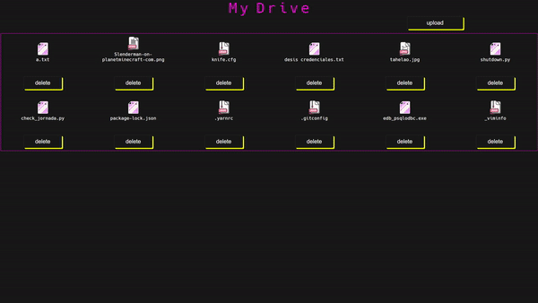

# MY DRIVE
## Your own local cloud

This is a small project to set up a local cloud to transfer files through your devices connected to your network.


# Few step to set up the cloud

1. Install XAMP
2. EDIT THE PHP.init
	change **post_max_size** to **500M**
	change **upload_max_fileseze** to **500M**
3. Copy this to **httpd-xampp.conf**
	```
	#New XAMPP security concept
	#
	#Close XAMPP security section here
	<LocationMatch “^/(?i:(?:security))”>
	Order deny,allow
	#Deny from all
	#Allow from ::1 127.0.0.0/8
	Allow from all
	ErrorDocument 403 /error/HTTP_XAMPP_FORBIDDEN.html.var
	</LocationMatch>
	#Close XAMPP sites here
	<LocationMatch “^/(?i:(?:xampp|licenses|phpmyadmin|webalizer|server-status|server-info))”>
	Order deny,allow
	#Deny from all
	#Allow from ::1 127.0.0.0/8
	Allow from all
	ErrorDocument 403 /error/HTTP_XAMPP_FORBIDDEN.html.var
	</LocationMatch>
	```
4. Start Apache and MySQL services
5. Create **files** table
	```sql
	DROP TABLE IF EXISTS `files`;
	CREATE TABLE IF NOT EXISTS `files` (
	`id` int(11) NOT NULL PRIMARY KEY AUTO_INCREMENT,
	`name` varchar(200) NOT NULL,
    `type` varchar(200) NOT NULL,
    `file_path` varchar(200) NOT NULL
    );
	```
6. Put the proyect folder into **xamp/htdocs**
7. Open your browser and type **your IP adress/my_drive**

## That's all!



